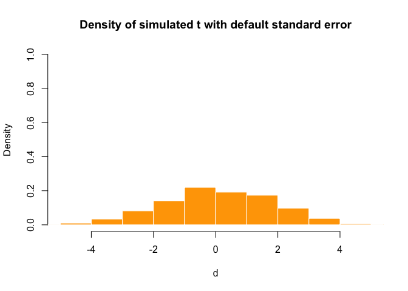
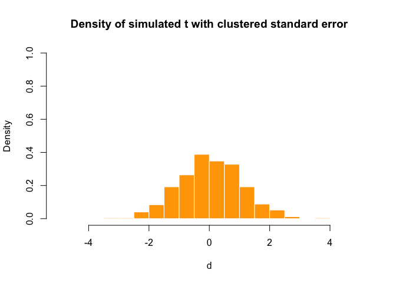
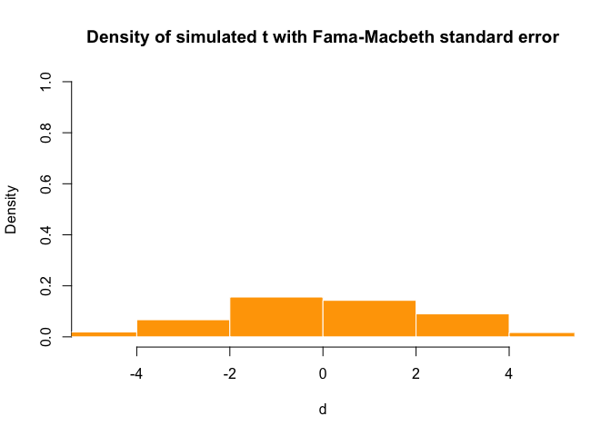
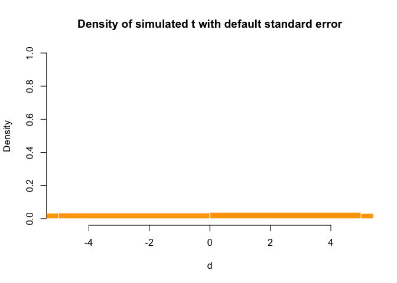
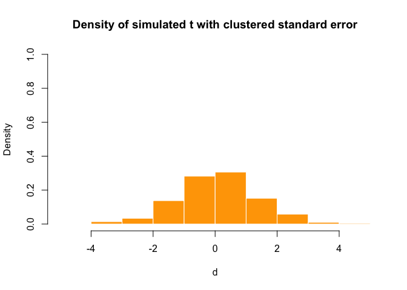
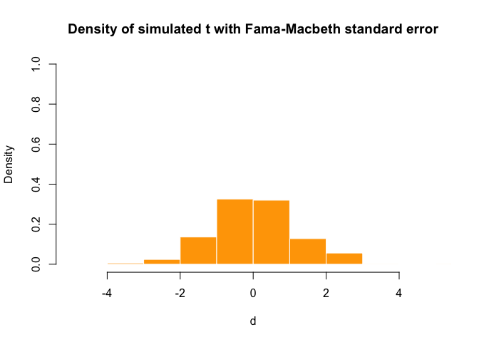

Replication of Petersen (2009) Simulation
================

``` r
knitr::opts_chunk$set(echo = TRUE)
library(parallel)
library(foreach)
library(doParallel)
library(lmtest)
library(sandwich)
library(plm)
library(knitr)
library(tidyverse)
set.seed(5, kind = "L'Ecuyer-CMRG")
```

[Petersen
(2009)](https://www.kellogg.northwestern.edu/faculty/petersen/htm/papers/standarderror.html)
is an influential paper guiding researchers picking correct standard
errors when using linear panel models (for the case without Omitted
Variable Bias (OVB)). A brief summary of the paper’s results can be
found in [my study note of linear panel model (Section
7.1)](https://github.com/maxleungtszchun/My-Econometrics-Notes/blob/main/notes%20on%20linear%20panel%20model.pdf).

Here is my R script replicating the paper’s key results. It can be
executed in both Windows and MacOS. However, it will be run much faster
in MacOS by using multiple CPUs due to the use of `doParallel` package.
To reduce running time, only 500 simulations instead of 5000 simulations
executed in the paper are performed.

``` r
gen_long_data <- function (N, T, var_gamma_i, var_mu_i, fe = "individual") {
  d <- tibble(.rows = N) %>% mutate(i = seq_len(N))
  d["gamma_i"] <- rnorm(N, mean = 0, sd = sqrt(var_gamma_i))
  d["mu_i"] <- rnorm(N, mean = 0, sd = sqrt(var_mu_i))

  gen_wide_data_i_eff <- function (df) {
    var_eta_it <- 4 - var_gamma_i
    var_upsilon_it <- 1 - var_mu_i
    for (t in seq_len(T)) {
      df[str_c("eta_i", t)] <- rnorm(N, mean = 0, sd = sqrt(var_eta_it))
      df[str_c("varepsilon_i", t)] <- df[["gamma_i"]] + df[[str_c("eta_i", t)]]
      df[str_c("upsilon_i", t)] <- rnorm(N, mean = 0, sd = sqrt(var_upsilon_it))
      df[str_c("x_i", t)] <- df[["mu_i"]] + df[[str_c("upsilon_i", t)]]
      df[str_c("y_i", t)] <- df[[str_c("x_i", t)]] * 1 + df[[str_c("varepsilon_i", t)]]
    }
    return(df)
  }

  gen_wide_data_t_eff <- function (df) {
    var_delta_t <- var_gamma_i
    var_zeta_t <- var_mu_i

    var_eta_it <- 4 - var_delta_t
    var_upsilon_it <- 1 - var_zeta_t
    for (t in seq_len(T)) {
      df[str_c("eta_i", t)] <- rnorm(N, mean = 0, sd = sqrt(var_eta_it))
      df[str_c("varepsilon_i", t)] <- rnorm(1, mean = 0, sd = sqrt(var_delta_t)) + df[[str_c("eta_i", t)]]
      df[str_c("upsilon_i", t)] <- rnorm(N, mean = 0, sd = sqrt(var_upsilon_it))
      df[str_c("x_i", t)] <- rnorm(1, mean = 0, sd = sqrt(var_zeta_t)) + df[[str_c("upsilon_i", t)]]
      df[str_c("y_i", t)] <- df[[str_c("x_i", t)]] * 1 + df[[str_c("varepsilon_i", t)]]
    }
    return(df)
  }

  gen_wide_data_it_eff <- function (df) {
    var_delta_t <- var_gamma_i
    var_zeta_t <- var_mu_i

    var_eta_it <- var_gamma_i
    var_upsilon_it <- var_mu_i
    for (t in seq_len(T)) {
      df[str_c("eta_i", t)] <- rnorm(N, mean = 0, sd = sqrt(var_eta_it))
      df[str_c("varepsilon_i", t)] <-
        df[["gamma_i"]] + rnorm(1, mean = 0, sd = sqrt(var_delta_t)) + df[[str_c("eta_i", t)]]
      df[str_c("upsilon_i", t)] <- rnorm(N, mean = 0, sd = sqrt(var_upsilon_it))
      df[str_c("x_i", t)] <-
        df[["mu_i"]] + rnorm(1, mean = 0, sd = sqrt(var_zeta_t)) + df[[str_c("upsilon_i", t)]]
      df[str_c("y_i", t)] <- df[[str_c("x_i", t)]] * 1 + df[[str_c("varepsilon_i", t)]]
    }
    return(df)
  }

  wide_data <-
    switch(
      fe,
      individual = gen_wide_data_i_eff(d),
      time = gen_wide_data_t_eff(d),
      both = gen_wide_data_it_eff(d),
      stop("only individual or time or both fe")
    )

  long_data <-
    wide_data %>%
    pivot_longer(
      cols = starts_with(c("y_i","x_i", "varepsilon_i", "eta_i", "upsilon_i")),
      names_to = c(".value", "t"),
      names_sep = "_i"
    )

  return(long_data)
}

simulation <- function (N, T, var_gamma_i, var_mu_i, sim_num, fe = "individual") {
  get_results <- function () {
    long_data <-
      gen_long_data(
        N = N,
        T = T,
        var_gamma_i = var_gamma_i,
        var_mu_i = var_mu_i,
        fe = fe
      ) %>%
      mutate(t = as.numeric(t))
    long_data_plm <- pdata.frame(long_data, index = c("i", "t"))

    pooled_ols <- plm(y ~ x + 0, model = "pooling", data = long_data_plm)
    ols <- lm(y ~ x + 0, data = long_data) # for calculating White's S.E. later by using sandwich::vcovHC()
    pooled_ols_coef_default_se <- coeftest(pooled_ols)
    clustered_i_var <- plm::vcovHC(pooled_ols, type = "HC1", cluster = "group")
    pooled_ols_coef_clustered_se_i <- coeftest(pooled_ols, vcov = clustered_i_var)
    clustered_t_var <- plm::vcovHC(pooled_ols, type = "HC1", cluster = "time")
    pooled_ols_coef_clustered_se_t <- coeftest(pooled_ols, vcov = clustered_t_var)
    # plm::vcovHC() =/= sandwich::vcovHC()
    clustered_both_var <- clustered_i_var + clustered_t_var - sandwich::vcovHC(ols, type = "HC1")
    pooled_ols_coef_clustered_se_both <- coeftest(pooled_ols, vcov = clustered_both_var)

    pooled_ols_coef_clustered_se <-
      switch(
        fe,
        individual = pooled_ols_coef_clustered_se_i,
        time = pooled_ols_coef_clustered_se_t,
        both = pooled_ols_coef_clustered_se_both,
        stop("only individual or time or both fe")
      )

    cs_betas <- list()
    for (j in seq_len(T)) {
      cs_betas[[j]] <-
        long_data %>%
        filter(t == j) %>%
        lm(y ~ x + 0, data = .) %>%
        summary(.) %>%
        .$coefficients %>%
        .[1,"Estimate"]
    }
    cs_betas <- as.numeric(cs_betas)
    fm_beta <- mean(cs_betas, na.rm = TRUE)
    fm_se <- sqrt(var(cs_betas, na.rm = TRUE) / T)

    return(list(
      "default" = pooled_ols_coef_default_se,
      "clustered" = pooled_ols_coef_clustered_se,
      "fm_beta" = fm_beta,
      "fm_se" = fm_se,
      "fm_t" = (fm_beta - 1) / fm_se
    ))
  }

  if (Sys.info()["sysname"] == "Windows") {
    results <- list()
    for (i in seq_len(sim_num)) {
      results[[i]] <- get_results()
    }
  } else {
    # using all CPUs in non-Windows OS e.g. MacOS
    registerDoParallel(detectCores())
    results <-
      foreach (i = seq_len(sim_num)) %dopar% {
        get_results()
      }
    stopImplicitCluster()
  }

  return(results)
}

get_sim_table <- function (N, T, var_gamma_i, var_mu_i, sim_num, fe = "individual") {
  sim_data <-
    simulation(
      N = N,
      T = T,
      var_gamma_i = var_gamma_i,
      var_mu_i = var_mu_i,
      sim_num = sim_num,
      fe = fe
    )

  t_default <- map_dbl(sim_data, ~ .x$default[1,"t value"] - 1 / .x$default[1,"Std. Error"])
  t_cluster <- map_dbl(sim_data, ~ .x$clustered[1,"t value"] - 1 / .x$clustered[1,"Std. Error"])
  t_fm <- map_dbl(sim_data, ~ .x$fm_t)

  per_sig_t_ols <- mean(as.numeric(abs(t_default) > 2.58), na.rm = TRUE)
  per_sig_t_c <- mean(as.numeric(abs(t_cluster) > 2.58), na.rm = TRUE)
  per_sig_t_fm <- mean(as.numeric(abs(t_fm) > 2.58), na.rm = TRUE)

  if (var_gamma_i == 2 & var_mu_i == 0.5) {
    plotHist <- function (d, title) {
      hist(d, prob = TRUE, xlim = c(-5, 5), ylim = c(0, 1), main = title, col = "orange", "border" = "white")
    }
    plotHist(t_default, "Density of simulated t with default standard error")
    plotHist(t_cluster, "Density of simulated t with clustered standard error")
    plotHist(t_fm, "Density of simulated t with Fama-Macbeth standard error")
  }

  simulated_pooled_ols_betas <- map_dbl(sim_data, ~ .x$default[ ,"Estimate"])
  return(list(
    "avg_beta_ols" = mean(simulated_pooled_ols_betas, na.rm = TRUE),
    "std_beta_ols" = sd(simulated_pooled_ols_betas, na.rm = TRUE),
    "avg_se_ols" = mean(map_dbl(sim_data, ~ .x$default[ ,"Std. Error"]), na.rm = TRUE),
    "per_sig_t_ols" = per_sig_t_ols,
    "avg_se_c" = mean(map_dbl(sim_data, ~ .x$cluster[ ,"Std. Error"]), na.rm = TRUE),
    "per_sig_t_c" = per_sig_t_c,
    "avg_beta_fm" = mean(map_dbl(sim_data, ~ .x$fm_beta), na.rm = TRUE),
    "std_beta_fm" = sd(map_dbl(sim_data, ~ .x$fm_beta), na.rm = TRUE),
    "avg_se_fm" = mean(map_dbl(sim_data, ~ .x$fm_se), na.rm = TRUE),
    "per_sig_t_fm" = per_sig_t_fm
  ))
}

# Var(varepsilon_it) = 4
# Var(x_it) = 1
sim_num <- 500
N <- 500
T <- 10
var_gamma_var_mu_list <-
  list(
    list(0, 0),
    list(0, 0.25),
    list(0, 0.5),
    list(0, 0.75),
    list(1, 0),
    list(1, 0.25),
    list(1, 0.5),
    list(1, 0.75),
    list(2, 0),
    list(2, 0.25),
    list(2, 0.5),
    list(2, 0.75),
    list(3, 0),
    list(3, 0.25),
    list(3, 0.5),
    list(3, 0.75)
  )

start_time <- Sys.time()
sim_table_i <-
  var_gamma_var_mu_list %>%
  map( ~ get_sim_table(N = N, T = T, var_gamma_i = .x[[1]],
                       var_mu_i = .x[[2]], sim_num = sim_num)) %>%
  do.call(bind_rows, .) %>%
  t()
```

<!-- --><!-- --><!-- -->

``` r
colnames(sim_table_i) <- var_gamma_var_mu_list
kable(sim_table_i, format = "simple", caption = "Only Individual Fixed Effect")
```
Only Individual Fixed Effect

|               | list(0, 0) | list(0, 0.25) | list(0, 0.5) | list(0, 0.75) | list(1, 0) | list(1, 0.25) | list(1, 0.5) | list(1, 0.75) | list(2, 0) | list(2, 0.25) | list(2, 0.5) | list(2, 0.75) | list(3, 0) | list(3, 0.25) | list(3, 0.5) | list(3, 0.75) |
|---------------|-----------:|--------------:|-------------:|--------------:|-----------:|--------------:|-------------:|--------------:|-----------:|--------------:|-------------:|--------------:|-----------:|--------------:|-------------:|--------------:|
| avg_beta_ols  |  0.9999291 |     0.9995866 |    0.9997824 |     0.9999791 |  0.9991195 |     1.0003254 |    1.0012801 |     1.0021393 |  0.9991312 |     1.0006163 |    1.0018140 |     1.0028820 |  0.9992020 |     1.0008652 |    1.0022242 |     1.0034282 |
| std_beta_ols  |  0.0285109 |     0.0280292 |    0.0281000 |     0.0285018 |  0.0283401 |     0.0367740 |    0.0422690 |     0.0467749 |  0.0281704 |     0.0423512 |    0.0516759 |     0.0592588 |  0.0281024 |     0.0470339 |    0.0593996 |     0.0694035 |
| avg_se_ols    |  0.0283031 |     0.0283100 |    0.0283379 |     0.0283698 |  0.0282668 |     0.0282895 |    0.0282978 |     0.0283130 |  0.0282454 |     0.0282807 |    0.0282874 |     0.0283009 |  0.0282216 |     0.0282739 |    0.0282791 |     0.0282910 |
| per_sig_t_ols |  0.0020000 |     0.0120000 |    0.0120000 |     0.0120000 |  0.0080000 |     0.0460000 |    0.0780000 |     0.1240000 |  0.0100000 |     0.0880000 |    0.1560000 |     0.2280000 |  0.0080000 |     0.1260000 |    0.2320000 |     0.3040000 |
| avg_se_c      |  0.0282244 |     0.0282858 |    0.0283324 |     0.0283652 |  0.0281755 |     0.0352350 |    0.0410593 |     0.0461880 |  0.0281488 |     0.0410663 |    0.0507524 |     0.0589098 |  0.0281247 |     0.0461638 |    0.0588659 |     0.0693281 |
| per_sig_t_c   |  0.0040000 |     0.0120000 |    0.0100000 |     0.0180000 |  0.0100000 |     0.0120000 |    0.0100000 |     0.0120000 |  0.0080000 |     0.0160000 |    0.0120000 |     0.0100000 |  0.0060000 |     0.0080000 |    0.0080000 |     0.0080000 |
| avg_beta_fm   |  0.9998982 |     0.9996348 |    0.9998447 |     1.0000274 |  0.9990867 |     1.0002552 |    1.0012440 |     1.0021378 |  0.9990996 |     1.0005623 |    1.0017885 |     1.0028835 |  0.9991739 |     1.0008311 |    1.0022111 |     1.0034327 |
| std_beta_fm   |  0.0285680 |     0.0280354 |    0.0281115 |     0.0285241 |  0.0283751 |     0.0368012 |    0.0422958 |     0.0468072 |  0.0281999 |     0.0423862 |    0.0517259 |     0.0593111 |  0.0281386 |     0.0470771 |    0.0594673 |     0.0694679 |
| avg_se_fm     |  0.0272252 |     0.0274720 |    0.0277030 |     0.0278883 |  0.0270076 |     0.0260943 |    0.0251176 |     0.0241653 |  0.0270049 |     0.0253624 |    0.0233805 |     0.0212648 |  0.0271049 |     0.0246264 |    0.0215344 |     0.0179261 |
| per_sig_t_fm  |  0.0340000 |     0.0160000 |    0.0220000 |     0.0280000 |  0.0280000 |     0.1000000 |    0.1400000 |     0.2220000 |  0.0180000 |     0.1380000 |    0.2820000 |     0.3840000 |  0.0180000 |     0.1940000 |    0.3760000 |     0.5200000 |


``` r
# for time fixed effect,
# var_gamma_i in get_sim_table() is actually var_delta_t, and
# var_mu_i in get_sim_table() is actually var_zeta_t
sim_table_t <-
  var_gamma_var_mu_list %>%
  map( ~ get_sim_table(N = N, T = T, var_gamma_i = .x[[1]],
                       var_mu_i = .x[[2]], sim_num = sim_num, fe = "time")) %>%
  do.call(bind_rows, .) %>%
  t()
```

<!-- --><!-- --><!-- -->

``` r
colnames(sim_table_t) <- var_gamma_var_mu_list
kable(sim_table_t, format = "simple", caption = "Only Time Fixed Effect")
```
Only Time Fixed Effect

|               | list(0, 0) | list(0, 0.25) | list(0, 0.5) | list(0, 0.75) | list(1, 0) | list(1, 0.25) | list(1, 0.5) | list(1, 0.75) | list(2, 0) | list(2, 0.25) | list(2, 0.5) | list(2, 0.75) | list(3, 0) | list(3, 0.25) | list(3, 0.5) | list(3, 0.75) |
|---------------|-----------:|--------------:|-------------:|--------------:|-----------:|--------------:|-------------:|--------------:|-----------:|--------------:|-------------:|--------------:|-----------:|--------------:|-------------:|--------------:|
| avg_beta_ols  |  0.9999291 |     1.0012365 |    1.0013543 |     1.0013210 |  0.9987830 |     1.0141492 |    1.0190271 |     1.0226802 |  0.9985202 |     1.0195067 |    1.0264324 |     1.0316380 |  0.9983583 |     1.0235349 |    1.0320363 |     1.0384397 |
| std_beta_ols  |  0.0285109 |     0.0299101 |    0.0306535 |     0.0314519 |  0.0283706 |     0.1485192 |    0.2071813 |     0.2599469 |  0.0278140 |     0.2081587 |    0.2917997 |     0.3667642 |  0.0271388 |     0.2541608 |    0.3569387 |     0.4489400 |
| avg_se_ols    |  0.0283031 |     0.0284491 |    0.0288185 |     0.0294875 |  0.0282321 |     0.0281379 |    0.0283100 |     0.0287603 |  0.0280546 |     0.0278666 |    0.0279585 |     0.0283182 |  0.0277899 |     0.0275023 |    0.0275096 |     0.0277719 |
| per_sig_t_ols |  0.0020000 |     0.0100000 |    0.0100000 |     0.0100000 |  0.0060000 |     0.6400000 |    0.7280000 |     0.7800000 |  0.0100000 |     0.7260000 |    0.8060000 |     0.8400000 |  0.0080000 |     0.7880000 |    0.8440000 |     0.8660000 |
| avg_se_c      |  0.0258505 |     0.0257176 |    0.0255487 |     0.0254029 |  0.0259109 |     0.1347283 |    0.1848355 |     0.2274532 |  0.0258553 |     0.1884824 |    0.2599701 |     0.3205851 |  0.0255778 |     0.2299699 |    0.3177989 |     0.3921891 |
| per_sig_t_c   |  0.0380000 |     0.0400000 |    0.0460000 |     0.0620000 |  0.0380000 |     0.0440000 |    0.0520000 |     0.0700000 |  0.0340000 |     0.0420000 |    0.0560000 |     0.0660000 |  0.0240000 |     0.0340000 |    0.0480000 |     0.0620000 |
| avg_beta_fm   |  0.9998982 |     1.0012481 |    1.0014645 |     1.0016270 |  0.9988956 |     1.0079709 |    1.0060311 |     1.0018340 |  0.9986174 |     1.0108680 |    1.0084250 |     1.0029442 |  0.9984335 |     1.0130245 |    1.0102448 |     1.0038537 |
| std_beta_fm   |  0.0285680 |     0.0306572 |    0.0336908 |     0.0403699 |  0.0283730 |     0.1281308 |    0.1782373 |     0.2515866 |  0.0278434 |     0.1786821 |    0.2498522 |     0.3532767 |  0.0271906 |     0.2177488 |    0.3050279 |     0.4314840 |
| avg_se_fm     |  0.0272252 |     0.0284584 |    0.0314351 |     0.0381028 |  0.0273694 |     0.1241828 |    0.1712766 |     0.2394546 |  0.0273269 |     0.1730625 |    0.2400866 |     0.3364972 |  0.0270501 |     0.2108919 |    0.2931724 |     0.4112550 |
| per_sig_t_fm  |  0.0340000 |     0.0240000 |    0.0260000 |     0.0300000 |  0.0300000 |     0.0240000 |    0.0260000 |     0.0280000 |  0.0280000 |     0.0180000 |    0.0220000 |     0.0260000 |  0.0200000 |     0.0180000 |    0.0220000 |     0.0260000 |


``` r
sim_table_both <-
  list(list(4/3, 1/3)) %>%
  map( ~ get_sim_table(N = 100, T = 100, var_gamma_i = .x[[1]],
                       var_mu_i = .x[[2]], sim_num = sim_num, fe = "both")) %>%
  do.call(bind_rows, .) %>%
  t()
kable(sim_table_both, format = "simple", caption = "Both Individual and Time Fixed Effect")
```
Both Individual and Time Fixed Effect

|               |           |
|:--------------|----------:|
| avg_beta_ols  | 1.0074608 |
| std_beta_ols  | 0.1035387 |
| avg_se_ols    | 0.0200694 |
| per_sig_t_ols | 0.6100000 |
| avg_se_c      | 0.0947216 |
| per_sig_t_c   | 0.0200000 |
| avg_beta_fm   | 1.0066888 |
| std_beta_fm   | 0.1023621 |
| avg_se_fm     | 0.0553240 |
| per_sig_t_fm  | 0.1620000 |


``` r
Sys.time() - start_time
```

Time difference of 2.686733 mins
